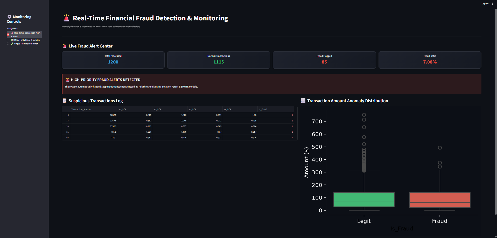
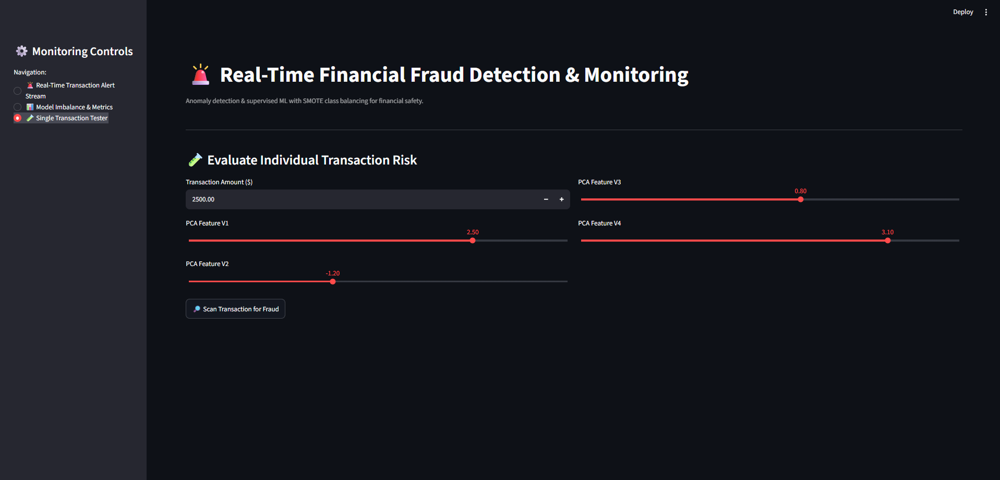

# Financial Fraud Detection Dashboard 📊

An end-to-end Machine Learning and Data Analytics project designed to detect, evaluate, and visualize fraudulent financial transactions in real time. This interactive application provides financial analysts with risk prediction scores, imbalance handling metrics, and instant fraud alerts.

---

## 🖼️ Dashboard Screenshots

### 1. Real-Time Transaction Alert


### 2. Model Imbalance & Performance Metrics


### 3. Single Transaction Risk Tester


---

## 🚀 Overview

The Financial Fraud Detection System helps financial institutions identify suspicious transactions and mitigate fraud risk efficiently. Built with Python and Streamlit, it integrates trained Machine Learning models to analyze transaction patterns, handle high class imbalance, and generate instant alerts for high-risk activity.

### Key Features:
- **Real-Time Fraud Alerts:** Instant detection notifications whenever a transaction crosses risk thresholds.
- **Imbalance & Metrics Dashboard:** Detailed visual reports including Precision, Recall, F1-Score, and ROC-AUC curves.
- **Single Transaction Testing:** Interactive UI to input transaction parameters and calculate fraud probability.
- **User-Friendly UI:** Clean and intuitive web interface for seamless fraud risk analysis.

---

## 🛠️ Tech Stack & Dependencies

- **Language:** Python 3.8+
- **Web Framework:** Streamlit / Flask
- **Data Processing:** Pandas, NumPy
- **Machine Learning:** Scikit-learn
- **Data Visualization:** Matplotlib, Seaborn

---

## 📁 Project Structure

```text
Fraud_Detection_Financial/
│
├── app.py                            # Main web application
├── Real_Time_transaction_Alert1.png  # Screenshot: Real-Time Fraud Alert View
├── Model_Imbalance_Metrics2.png      # Screenshot: Model Imbalance & Metrics View
├── Single_Transaction_Tester3.png    # Screenshot: Single Transaction Tester View
└── requirements.txt                  # List of required Python packages
